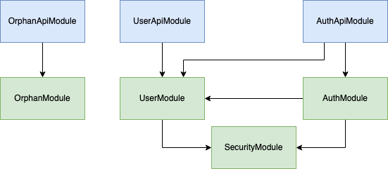

<p align="center">
  <a href="http://nestjs.com/" target="blank"></a>
</p>
<h1 align="center">Pass Moi L'Goss API server</h1>


## Description

Project realised in the context of a Hackathon organized by the [ENSICAEN](https://www.ensicaen.fr)  & [Le Dôme](http://www.ledome.info/)

Pas Moi L'Goss is a fake marketplace for adoption centers
## Installation

```bash
$ npm install
```

## Configuration
### Server
Copy the `src/assets/config-template.json` file as `src/assets/config.json`
```bash
$ cp src/assets/config-template.json src/assets/config.json
```
Feel free to edit settings to match your environment requirements


### Database

- Create a user named pmg with password pmg
- Allow it to login if necessary
- Create a database named 'passmoilgoss' and give all permissions to user pmg on it

Copy the `prisma/.env.template` file as `prisma/.env`
```bash
$ cp prisma/.env.template prisma/.env
```
Feel free to edit settings to match your environment requirements

## Push database schema

```bash
$ npx prisma db push
```

## Running the app

```bash
# development
$ npm run start:dev

# production mode
$ npm run start:prod
```

## Test

```bash
# all tests
$ npm run mocha

# e2e tests
$ npm run mocha:e2e

# test coverage
$ npm run mocha:cov
```

## Internal Dependency Graph

Green = **Core** modules

Blue = **API** modules



## License

Nest is [MIT licensed](LICENSE).
